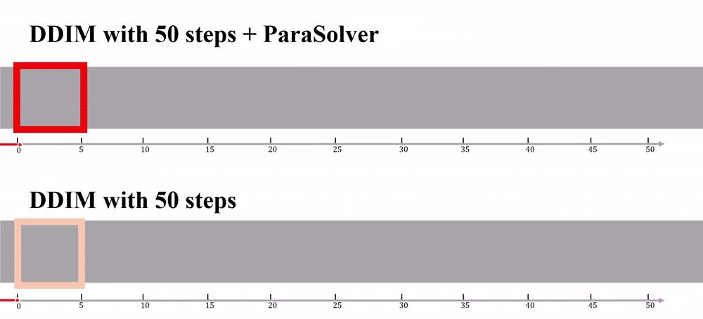
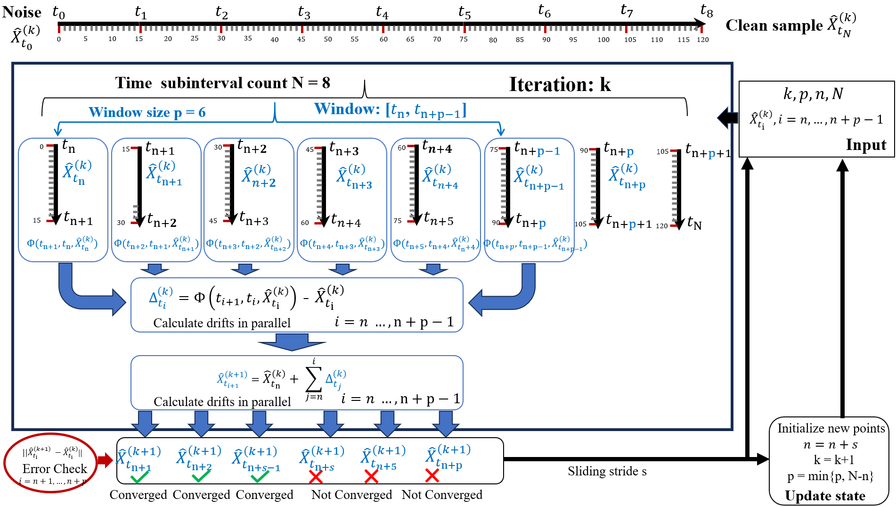
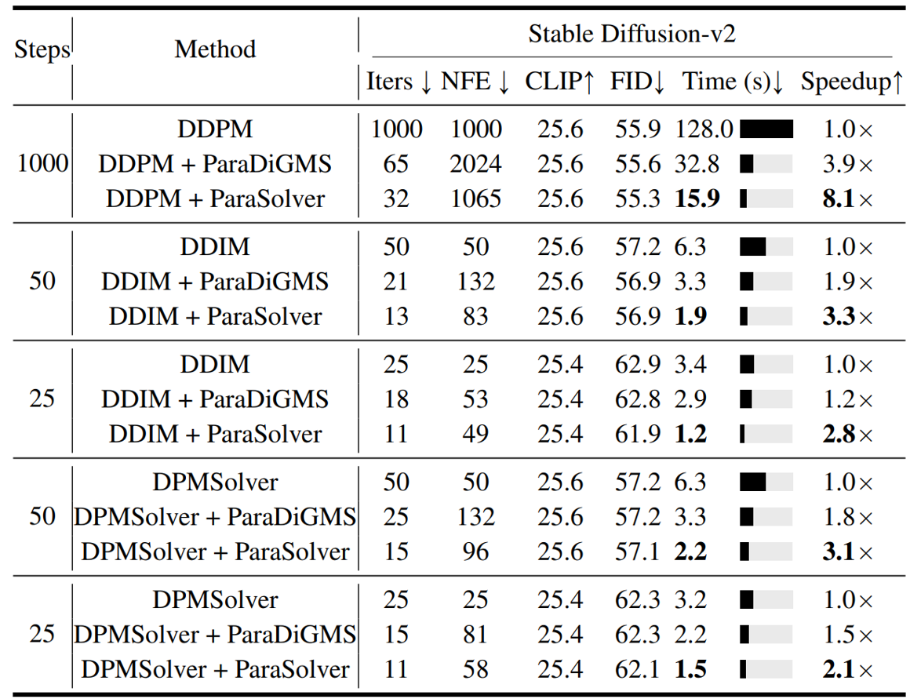
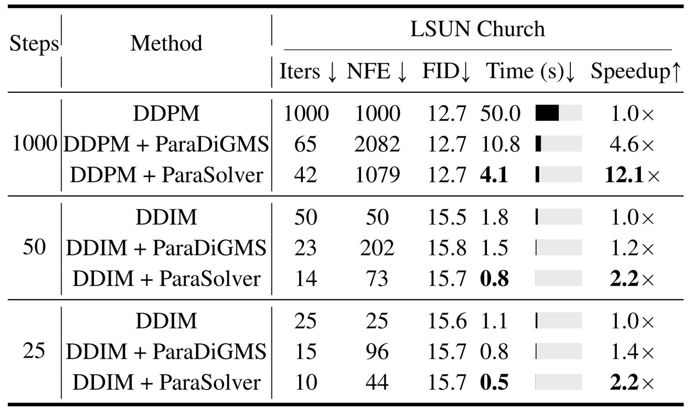

<p align="center">
  <h1 align="center">【ICLR 2025】 ParaSolver: A Hierarchical Parallel Integral Solver for Diffusion Models</h1>

  <p align="center">
    <br />
    <a href="https://scholar.google.com/citations?user=k-oe9TUAAAAJ&hl=zh-CN"><strong>Jianrong Lu</strong></a>
    ·
    <a href="https://scholar.google.com/citations?user=d1L0KkoAAAAJ&hl=en"><strong>Zhiyu Zhu*</strong></a>
    ·
    <a href="https://sites.google.com/site/junhuihoushomepage/"><strong>Junhui Hou</strong></a>
  </p>
</p>

[](https://openreview.net/forum?id=2JihLwirxO)
[](LICENSE)

Official implementation of ["ParaSolver: A Hierarchical Parallel Integral Solver for Diffusion Models" (ICLR 2025)](https://openreview.net/forum?id=2JihLwirxO)

## 📢 News

- **2025-06-10** 📦 🎉 The codes are available now!
- **2025-06-06** ⚙️ 🛠️ We are organizing the code
- **2025-04-22** ⌛ 📅 The code is scheduled to be released between May 16 and June 20  
- **2025-01-23** 📜 🎓 Our paper has been accepted by ICLR 2025!


## 🌟 **Method Overview Video**  

<div align="center">  
 ✨ Watch the Video on your preferred platform ✨  
</div>

### 📺 **Video Platform**
-  **[▶️ YouTube](https://youtu.be/u5qnG809AYs)**  
  *The world's largest video platform*
  

### 📱 **Social Platforms**
-  **[💬 WeChat](https://mp.weixin.qq.com/s/RJ6SZ3TQX-XkgGwyCl3Hag)**  
  *Scan to watch in WeChat ecosystem*
  
-  **[📕 Xiaohongshu](https://www.xiaohongshu.com/discovery/item/68491766000000002301e488?app_platform=ios&app_version=8.86&share_from_user_hidden=true&xsec_source=app_share&type=video&xsec_token=CBir9tUqeTi_mQN5VGOBiSvilRPy9GTLOuDVEr4J0dnVI=&author_share=1&xhsshare=WeixinSession&shareRedId=ODlGRDZHOUw2NzUyOTgwNjg5OTc7NjpB&apptime=1749623383&share_id=a746a4be39b44c00ae66b68010da45d9)**  
  *Discover lifestyle content*


---

<!-- <div align="center" style="margin-top:20px">
📌 <em>Same premium content across all platforms</em> • 🔹 <em>Choose your favorite!</em>
</div> -->


## 🌟 Introduction
ParaSolver revolutionizes diffusion model sampling by transforming the sequential inference process into a hierarchical parallel computation. Our method achieves up to **12.1× speedup** without compromising sample quality.





### Key Features:
- **Training-free acceleration**: Works with existing diffusion models
- **Hierarchical parallelism**: Efficiently utilizes computing resources
- **Quality preservation**: Maintains FID/CLIP scores while being faster
- **Flexible integration**: Compatible with DDPM, DDIM, DPMSolver, etc.

## 🚀 Quick Start

### Installation
```bash
git clone https://github.com/Jianrong-Lu/ParaSolver.git
cd ParaSolver
pip install -r requirements.txt
```

### Basic Usage 

#### Single GPU
To use ParaSolver to accelerate DDPM on a single GPU, here's a minimal example:

```python
import torch
from sd_parasolver.stablediffusion_parasolver_ddpm_mp import ParaSolverDDPMStableDiffusionPipeline
from sd_parasolver.paraddpm_scheduler import ParaDDPMScheduler

# Initialize the pipeline
model_id = "stabilityai/stable-diffusion-2"
torch_dtype = torch.float16
device = "cuda:0"  

# Create scheduler and pipeline
scheduler = ParaDDPMScheduler.from_pretrained(
    model_id, 
    subfolder="scheduler", 
    timestep_spacing="trailing",
    torch_dtype=torch_dtype
)
scheduler._is_ode_scheduler = False

pipe = ParaSolverDDPMStableDiffusionPipeline.from_pretrained(
    model_id, 
    scheduler=scheduler, 
    torch_dtype=torch_dtype,
    safety_checker=None
).to(device)

# Enable memory efficient attention and set to eval mode
pipe.enable_xformers_memory_efficient_attention()
pipe.unet.eval()

# Generate an image
prompt = "A highly detailed portrait of an elderly man with wrinkles, 
wearing a traditional woolen hat, cinematic lighting, 8K, ultra-realistic, 
photorealistic, depth of field, soft shadows,film grain."

generator = torch.Generator(device=device).manual_seed(12)

output = pipe.parasolver_forward(
    prompt,
    num_inference_steps=1000,
    num_time_subintervals=1000,
    num_preconditioning_steps=5,
    parallel=8,  
    num_images_per_prompt=1,
    tolerance=0.55,
    output_type="pil",
    generator=generator
)

# Save the image
image = output.images[0]
image.save("generated_image.png")
```

#### Multiple GPUs
For multi-GPU usage, please run [`Expr_CMP_SD.py`](Expr_CMP_SD.py) in the repository with appropriate configuration.
```python
python Expr_CMP_SD.py
```


## ⚡ Performance Benchmarks

### Stable Diffusion v2 Acceleration

<!-- Todo -->

### LSUN Church Acceleration

<!-- Todo -->

<!-- ## 🎨 Visual Results
Todo -->

## 🛠 Advanced Usage

### Integration with Popular Frameworks [Diffusers](https://huggingface.co/docs/diffusers/index)
Todo

## 📝 Citation
If you use ParaSolver in your research, please cite our paper:
```bibtex
@inproceedings{lu2025parasolver,
  title={ParaSolver: A Hierarchical Parallel Integral Solver for Diffusion Models},
  author={Lu, Jianrong and Zhu, Zhiyu and Hou, Junhui},
  booktitle={International Conference on Learning Representations},
  year={2025}
}
```

## 🤝 Contributing
We welcome contributions!

## 🙏 Acknowledgement

We extend our gratitude to these wonderful projects and resources that made our work possible:

- 🌸 [Diffusers](https://huggingface.co/docs/diffusers/index) - The foundational library for diffusion models
- 🔥 [PyTorch](https://pytorch.org/) - Our deep learning framework of choice
- 🤗 [Hugging Face](https://huggingface.co/) - For model sharing infrastructure
- 🏛️ [Stable Diffusion](https://stability.ai/) - The base models we built upon
- 📚 [Our University/Institution] - For computational resources and support

*Special thanks to all contributors and open-source maintainers in the community!*

